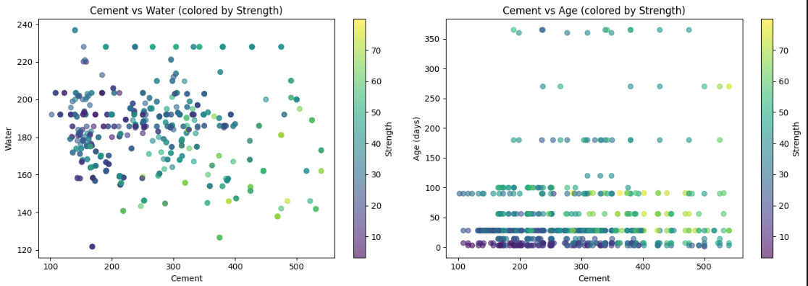
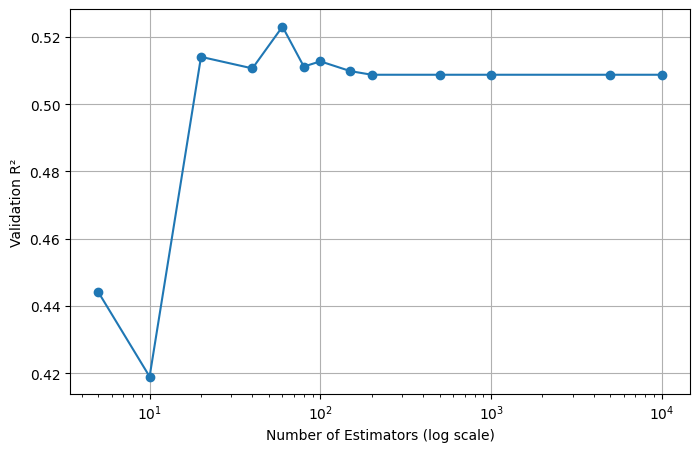

<div align="center">

# 🏗️ End-to-End Analysis & Manual AdaBoost Implementation on Concrete Strength Prediction

### Predicting Concrete Compressive Strength using Ensemble Learning


<br>

### 📈 Final Performance

| Test R² | CV R² | MAE | RMSE |
|:---:|:---:|:---:|:---:|
| **0.816** | **0.818** | **6.57 MPa** | **7.94 MPa** |

</div>

---

> Built a complete regression pipeline combining **EDA, manual AdaBoost.R2 implementation, and optimized Scikit-Learn boosting** to predict concrete compressive strength.

---

# ✨ Highlights

✔ Implemented **AdaBoost.R2 from scratch**  
✔ Performed **data cleaning & exploratory analysis**  
✔ Compared **Manual vs Scikit-Learn implementation**  
✔ Improved model performance from **R² = 0.44 → 0.816**  
✔ Tuned using **GridSearchCV + Cross Validation**

---

# 🎯 Objective

Predict **Concrete Compressive Strength (MPa)** using material composition and curing conditions while studying:

- Ensemble learning for regression
- Manual boosting mechanics
- Effect of model complexity on prediction quality

---

# 📊 Dataset

### Features
- Cement
- Blast Furnace Slag
- Fly Ash
- Water
- Superplasticizer
- Coarse Aggregate
- Fine Aggregate
- Age

### Target
Concrete Compressive Strength (MPa)

### Dataset Summary

| Metric | Value |
|---|---:|
| Original Samples | 1030 |
| Final Samples | 1005 |
| Features | 8 |
| Mean Strength | 35.25 MPa |
| Minimum | 2.33 MPa |
| Maximum | 82.60 MPa |

---

# 🧹 Data Cleaning & Validation

### Missing Values

Checked using:

```python
.isnull().sum()
```

Result:

✅ No missing values found.

### Duplicate Removal

Checked using:

```python
.duplicated().sum()
```

Result:

- Found **25 duplicate rows**
- Removed duplicates

Final dataset:

```text
(1005, 9)
```

### Statistical Exploration

Used:

```python
.describe()
.corr()
.shape
```

Key observations:

- Cement showed strongest positive relationship with strength
- Water showed negative relationship
- Age introduced non-linear effects

---

# 📈 Exploratory Data Analysis

## Cement vs Concrete Strength



### Key Findings

- Higher cement content generally increased compressive strength
- Relationship showed a clear positive trend
- Variability increased for larger cement quantities

---

# ⚙️ Manual AdaBoost.R2 Implementation

Implemented manually using:

✔ Sample Weight Initialization  
✔ Weighted Training  
✔ Error Normalization  
✔ Adaptive Weight Updates  
✔ Weighted Median Aggregation  
✔ Early Stopping  

### Configuration

```python
DecisionTreeRegressor(max_depth=1)

learning_rate = 0.1
M = 60
```

### Manual Model Result

| Metric | Score |
|---|---:|
| Test R² | 0.442 |

Observation:

Performance plateaued due to the limited capacity of decision stumps.

---

# 📉 Estimator Optimization

## Validation Performance Across Estimator Count



### Findings

- Increasing estimators initially improved performance
- Gains saturated after an optimal region
- Additional estimators produced minimal improvement

---

# 🚀 Optimized Scikit-Learn AdaBoost

Hyperparameter tuning performed using:

```text
GridSearchCV
5-Fold Cross Validation
```

Best Configuration:

```python
AdaBoostRegressor(
    estimator=DecisionTreeRegressor(
        max_depth=4
    ),
    n_estimators=500,
    learning_rate=0.1
)
```

---

# 🏆 Final Results

| Metric | Manual | Optimized |
|---|---:|---:|
| Test R² | 0.442 | **0.816** |
| Cross Validation R² | — | **0.818** |
| MAE | — | **6.57 MPa** |
| RMSE | — | **7.94 MPa** |

---

# 🔬 Key Takeaways

- Manual AdaBoost reproduced the boosting workflow successfully
- Weighted median stabilized regression predictions
- Reweighting improved robustness over resampling
- Increasing tree depth captured complex relationships
- Final optimized model achieved **81.6% explained variance**

---

# 🛠 Tech Stack

```text
Python
NumPy
Pandas
Matplotlib
Scikit-Learn
Jupyter Notebook
```

---

# ▶ Run Locally

```bash
pip install -r requirements.txt

jupyter notebook
```

---